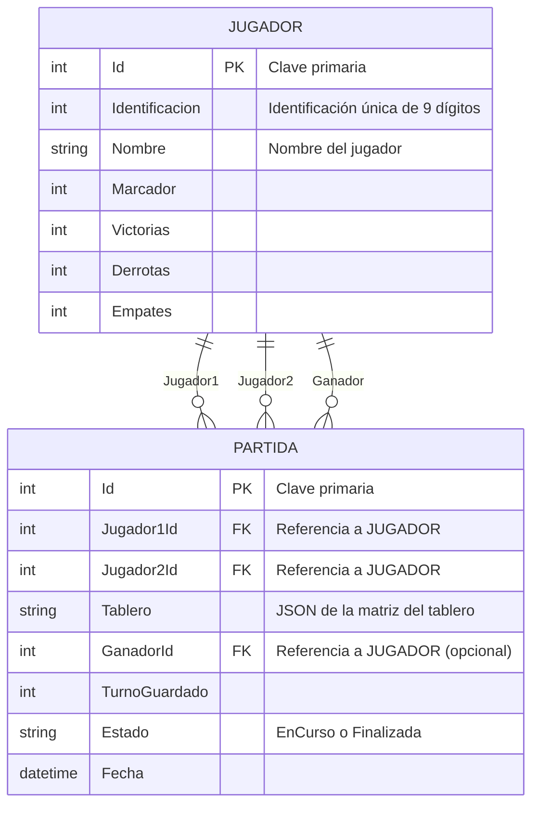

# Connect4GameG5
Juego Connect4 

# Proyecto Connect4

## Integrantes del grupo

| Nombre de usuario | Correo electrónico | Carné |
|------------------|-----------------|-------|
| dylaannep        | despinoza50014@ufide.ac.cr | FH23013870 |
| TayronGC         | tguzman30879@ufide.ac.cr   | FI23032601 |
| Mauma1306        | losmau1306@gmail.com       | FH23013896 |

## Frameworks y herramientas utilizadas

- .NET 8.0 Core
- Entity Framework Core 9
- SQL Server
- Visual Studio Code
- Bootstrap 5 (para el frontend)
- Mermaid (para diagramas)

## Tipo de aplicación

- MPA (Multi-Page Application)

## Arquitectura utilizada

- MVC (Modelo-Vista-Controlador)

## Diagrama de la base de datos

## Frameworks y herramientas utilizadas

### Clonar el repositorio
git clone [URL del repositorio]
cd [nombre_del_proyecto]

## Instalar dependencias
dotnet restore

## Compilar el proyecto
dotnet build

## Ejecutar Aplicacion
dotnet run